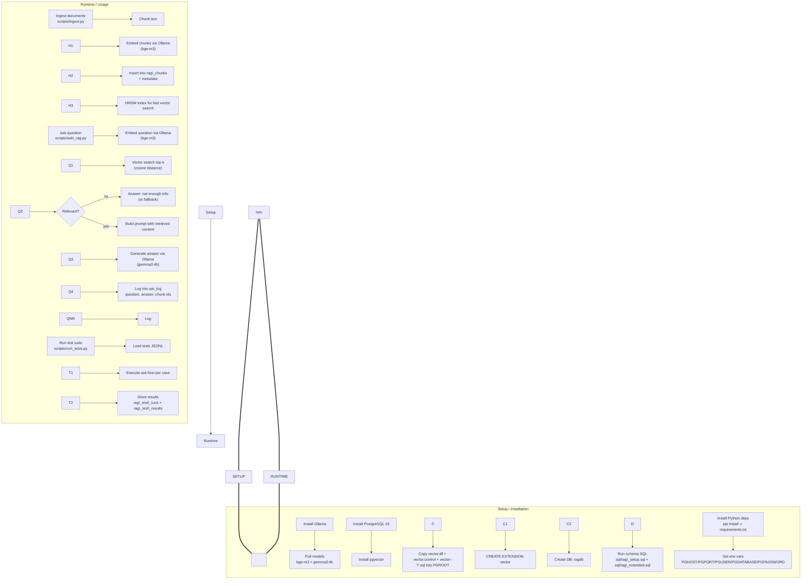

# \# Process Visualization — rag-ollama-set-up (end-to-end)

# 

\## 1) Big Picture: Setup → Runtime

```mermaid

flowchart TD

&nbsp; %% ===== SETUP =====

&nbsp; subgraph Setup\["Setup / Installation"]

&nbsp;   A\["Install Ollama"] --> A2\["Pull models<br/>bge-m3 + gemma3:4b"]

&nbsp;   B\["Install PostgreSQL 16"] --> C\["Install pgvector"]

&nbsp;   C --> C1\["Copy vector.dll + vector.control + vector--\*.sql into PGROOT"]

&nbsp;   C1 --> C2\["CREATE EXTENSION vector"]

&nbsp;   C2 --> D\["Create DB: ragdb"]

&nbsp;   D --> E\["Run schema SQL<br/>sql/rag\_setup.sql + sql/rag\_extended.sql"]

&nbsp;   F\["Install Python deps<br/>pip install -r requirements.txt"] --> G\["Set env vars<br/>PGHOST/PGPORT/PGUSER/PGDATABASE/PGPASSWORD"]

&nbsp; end


&nbsp; %% ===== RUNTIME =====

&nbsp; subgraph Runtime\["Runtime / Usage"]

&nbsp;   H\["Ingest documents<br/>scripts/ingest.py"] --> H1\["Chunk text"]

&nbsp;   H1 --> H2\["Embed chunks via Ollama<br/>(bge-m3)"]

&nbsp;   H2 --> H3\["Insert into rag\_chunks<br/>+ metadata"]

&nbsp;   H3 --> H4\["HNSW index for fast vector search"]


&nbsp;   Q\["Ask question<br/>scripts/ask\_rag.py"] --> Q1\["Embed question via Ollama<br/>(bge-m3)"]

&nbsp;   Q1 --> Q2\["Vector search top-k<br/>(cosine distance)"]

&nbsp;   Q2 --> Gate{"Relevant?"}

&nbsp;   Gate -- "no" --> QNR\["Answer: not enough info<br/>(or fallback)"]

&nbsp;   Gate -- "yes" --> Q3\["Build prompt with retrieved context"]

&nbsp;   Q3 --> Q4\["Generate answer via Ollama<br/>(gemma3:4b)"]

&nbsp;   Q4 --> Log\["Log into qa\_log<br/>question, answer, chunk ids"]

&nbsp;   QNR --> Log


&nbsp;   T\["Run test suite<br/>scripts/run\_tests.py"] --> T1\["Load tests JSONL"]

&nbsp;   T1 --> T2\["Execute ask flow per case"]

&nbsp;   T2 --> T3\["Store results<br/>rag\_test\_runs + rag\_test\_results"]

&nbsp; end


&nbsp; Setup --> Runtime

```

