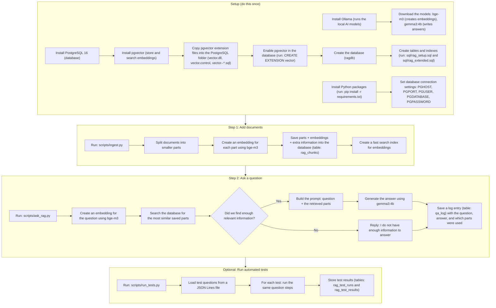

# \# Process Visualization — rag-ollama-set-up (end-to-end)

```mermaid
flowchart TD

subgraph Setup["Setup (do this once)"]
  S1["Install Ollama (runs the local AI models)"] --> S2["Download the models: bge-m3 (creates embeddings), gemma3:4b (writes answers)"]

  S3["Install PostgreSQL 16 (database)"] --> S4["Install pgvector (store and search embeddings)"]
  S4 --> S5["Copy pgvector extension files into the PostgreSQL folder (vector.dll, vector.control, vector--*.sql)"]
  S5 --> S6["Enable pgvector in the database (run: CREATE EXTENSION vector)"]
  S6 --> S7["Create the database (ragdb)"]
  S7 --> S8["Create tables and indexes (run: sql/rag_setup.sql and sql/rag_extended.sql)"]

  S9["Install Python packages (run: pip install -r requirements.txt)"] --> S10["Set database connection settings: PGHOST, PGPORT, PGUSER, PGDATABASE, PGPASSWORD"]
end

subgraph Ingest["Step 1: Add documents"]
  I1["Run: scripts/ingest.py"] --> I2["Split documents into smaller parts"]
  I2 --> I3["Create an embedding for each part using bge-m3"]
  I3 --> I4["Save parts + embeddings + extra information into the database (table: rag_chunks)"]
  I4 --> I5["Create a fast search index for embeddings"]
end

subgraph Ask["Step 2: Ask a question"]
  A1["Run: scripts/ask_rag.py"] --> A2["Create an embedding for the question using bge-m3"]
  A2 --> A3["Search the database for the most similar saved parts"]
  A3 --> G{"Did we find enough relevant information?"}
  G -- "No" --> A4["Reply: I do not have enough information to answer"]
  G -- "Yes" --> A5["Build the prompt: question + the retrieved parts"]
  A5 --> A6["Generate the answer using gemma3:4b"]
  A6 --> A7["Save a log entry (table: qa_log) with the question, answer, and which parts were used"]
  A4 --> A7
end

subgraph Tests["Optional: Run automated tests"]
  T1["Run: scripts/run_tests.py"] --> T2["Load test questions from a JSON Lines file"]
  T2 --> T3["For each test: run the same question steps"]
  T3 --> T4["Store test results (tables: rag_test_runs and rag_test_results)"]
end

Setup --> Ingest --> Ask --> Tests
```