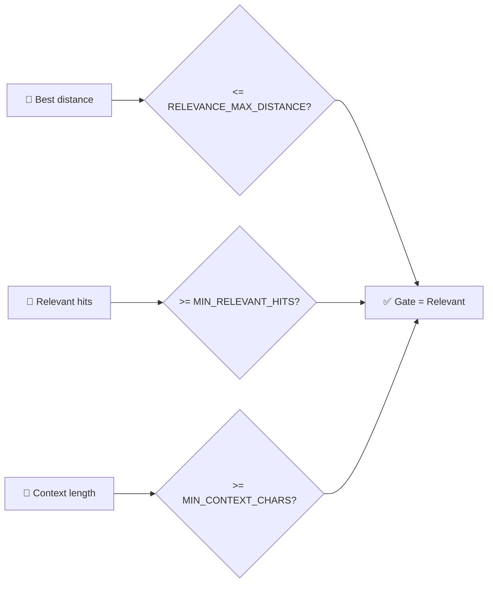

# \# Process Visualization — rag-ollama-set-up (end-to-end)

This page visualizes the full workflow we implemented:
- PostgreSQL + pgvector (vector DB + HNSW index)
- Ollama embeddings (bge-m3) + Ollama chat (gemma3:4b)
- Python scripts for ingestion, retrieval, generation, logging, and testing

---

```mermaid
flowchart TD

 subgraph Runtime["Runtime"]

  Ingest["📥 Ingest docs (ingest.py)"] --> Chunk["✂️ Chunk text"]
  Chunk --> EmbedDocs["🧠 Embed docs (bge-m3)"]
  EmbedDocs --> Store["🗄️ Store in rag_chunks"]

  U([👤 User asks a question]) --> Q[🧠 Embed question<br/>Ollama: bge-m3]

  Q --> S[🔎 Vector search in Postgres<br/>pgvector HNSW]
  S --> R[📦 Top-K chunks + distances]

  R --> G{🎯 Relevant enough?}

  G -- "No 😕" --> N[🙅 Reply: Not enough info<br/>Ask user for more context]
  N --> L1[(📝 Log to qa_log)]

  G -- "Yes ✅" --> C[🧩 Build context prompt<br/>chunks + citations]
  C --> A[💬 Answer with Ollama<br/>gemma3:4b]
  A --> L2[(📝 Log to qa_log)]

  L2 --> AU{🕵️ Audit enabled?}
  AU -- "No" --> DONE([✅ Done])

  AU -- "Yes" --> J[🧪 LLM Judge: quality + groundedness]
  J --> V{✅ Pass?}

  V -- "Yes" --> DONE
  V -- "No" --> F[(🗳️ Store feedback / failure)]
  F --> DONE
```

---

