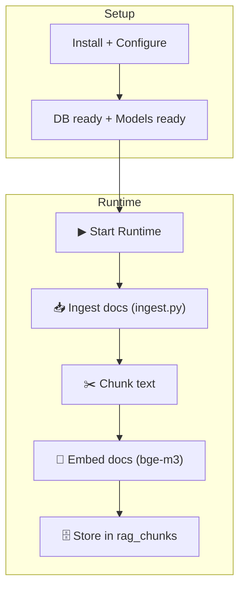
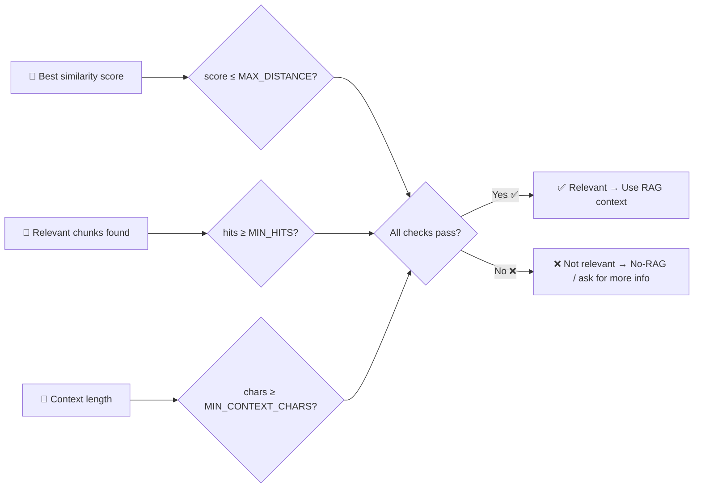

# \# Process Visualization — rag-ollama-set-up (end-to-end)

This page visualizes the full workflow we implemented:
- PostgreSQL + pgvector (vector DB + HNSW index)
- Ollama embeddings (bge-m3) + Ollama chat (gemma3:4b)
- Python scripts for ingestion, retrieval, generation, logging, and testing

---


---

```mermaid
flowchart TD

  START([🚀Start]) --> AUTH{Authentication enabled?}

  AUTH -- "No" --> DENY[❌ Access denied] --> END0([End])

  AUTH -- "Yes" --> ROLE[👥 Load user role + groups]
  ROLE --> PERM[🔐 Permission check: what data can this user access?]

  PERM --> HASRAG{RAG available for this question/user?}

  HASRAG -- "No" --> LLMONLY["💬 Ask LLM directly<br/>(no RAG)"]
  LLMONLY --> LOG0[("📝 Log to qa_log)"]
  LOG0 --> END([✅ Done])

  HASRAG -- "Yes" --> ROUTE["🧭 Route to respective RAG<br/>(client / internal / external)"]

  %% --- RAG Retrieval + Relevancy Gate ---
  ROUTE --> Q["🧠 Embed question (bge-m3)"]
  Q --> S[🔎 Search the database for most similar saved parts]
  S --> R[📦 Pick the 5 most relevant text snippets and how strongly they match the question]

  R --> G{🎯 Relevant enough?}

  %% Not relevant path
  G -- "No 😕" --> N[🙅 Reply: Not enough info<br/>Ask user for more context]
  N --> L1[(📝 Log to qa_log)]
  classDef animate stroke-dasharray: 9,5,stroke-dashoffset: 900,animation: dash 25s linear infinite;
  class e1 animate

  %% Relevant path
  G -- "Yes ✅" --> C[🧩 Build context prompt<br/>chunks + citations]
  C --> A[💬 Answer with Ollama<br/>gemma3:4b]
  A --> L2[(📝 Log to qa_log)]

  %% --- Optional audit ---
  L2 --> AU{🕵️ Audit enabled?}
  AU -- "No" --> DONE([✅ Done])

  AU -- "Yes" --> J[🧪 LLM Judge: quality + groundedness]
  J --> V{✅ Pass?}

  V -- "Yes" --> DONE
  V -- "No" --> F[(🗳️ Store feedback / failure)]
  F --> DONE

```

---


