```mermaid
flowchart TD

  subgraph Setup["Setup<br/>"]
    S1["Install + Configure"] --> S2["DB ready + Models ready"]
  end  

  S2 --> R0["▶ Start Runtime"]
  subgraph Runtime["Runtime"]
    R0 --> Ingest["📥 Ingest docs (ingest.py)"]
    Ingest --> Chunk["✂️ Chunk text"]
    Chunk --> EmbedDocs["🧠 Embed docs (bge-m3)"]
    EmbedDocs --> Store["🗄️ Store in rag_chunks"]
  end

```

```mermaid
flowchart TD

  START([🚀 Start]) --> AUTH{"🔐 Authentication enabled?"}

  AUTH -- "No" --> ROLE["👤 Treat as anonymous / default role"]
  AUTH -- "Yes" --> LOGIN["🪪 Authenticate user"]
  LOGIN --> OK{"✅ Auth success?"}
  OK -- "No" --> DENY["❌ Access denied"] --> END0([⛔ End])
  OK -- "Yes" --> ROLE["🏷️ Load user role + groups"]

  ROLE --> PERM["🛡️ Permission check<br/>what data can this user access?"]
  PERM --> HASACCESS{Any access at all?}
  HASACCESS -- "No" --> DENY --> END0
  HASACCESS -- "Yes" --> ROUTE[RAG routing rules]

  ROUTE --> HASRAG{Is there a RAG for this question?}
  HASRAG -- "No" --> LLMONLY["Ask LLM directly (no RAG)"]
  HASRAG -- "Yes" --> QEMB["Embed question (bge-m3)"]
  

  Q --> S[🔎 Search the database for most similar saved parts]
  S --> R[📦 Pick the 5 most relevant text snippets and how strongly they match the question]

  R --> G{🎯 Relevant enough?}

  G -- "No 😕" --> N[🙅 Reply: Not enough info<br/>Ask user for more context]
  N --> L1[(📝 Log to qa_log)]
  classDef animate stroke-dasharray: 9,5,stroke-dashoffset: 900,animation: dash 25s linear infinite;
  class e1 animate

  G -- "Yes ✅" --> C[🧩 Build context prompt<br/>chunks + citations]
  C --> A[💬 Answer with Ollama<br/>gemma3:4b]
  A --> L2[(📝 Log to qa_log)]

  L2 --> AU{🕵️ Audit enabled?}
  AU -- "No" --> DONE([✅ Done])

  AU -- "Yes" --> J[🧪 LLM Judge: quality + groundedness]
  J --> V{✅ Pass?}

  V -- "Yes" --> DONE
  V -- "No" --> F[(🗳️ Store feedback / failure)]
  F --> DONE

```

```mermaid

flowchart LR

  D["📏 Best similarity score"] --> T{"score ≤ MAX_DISTANCE?"}
  H["🔢 Relevant chunks found"] --> M{"hits ≥ MIN_HITS?"}
  C["🧾 Context length"] --> K{"chars ≥ MIN_CONTEXT_CHARS?"}

  T --> AND{"All checks pass?"}
  M --> AND
  K --> AND

  AND -- "Yes ✅" --> G["✅ Relevant → Use RAG context"]
  AND -- "No ❌" --> N["❌ Not relevant → No-RAG / ask for more info"]


```

# \# Process Visualization — rag-ollama-set-up (end-to-end)

This page visualizes the full workflow we implemented:
- PostgreSQL + pgvector (vector DB + HNSW index)
- Ollama embeddings (bge-m3) + Ollama chat (gemma3:4b)
- Python scripts for ingestion, retrieval, generation, logging, and testing

---

---

---

